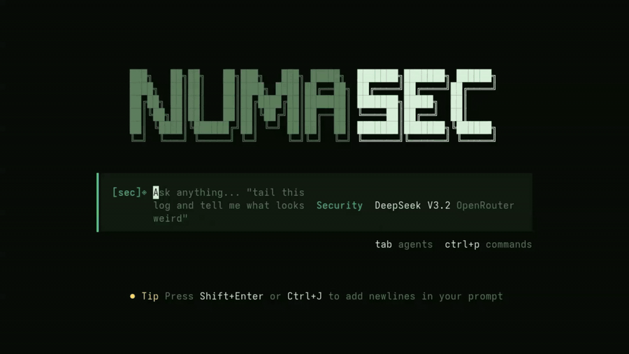
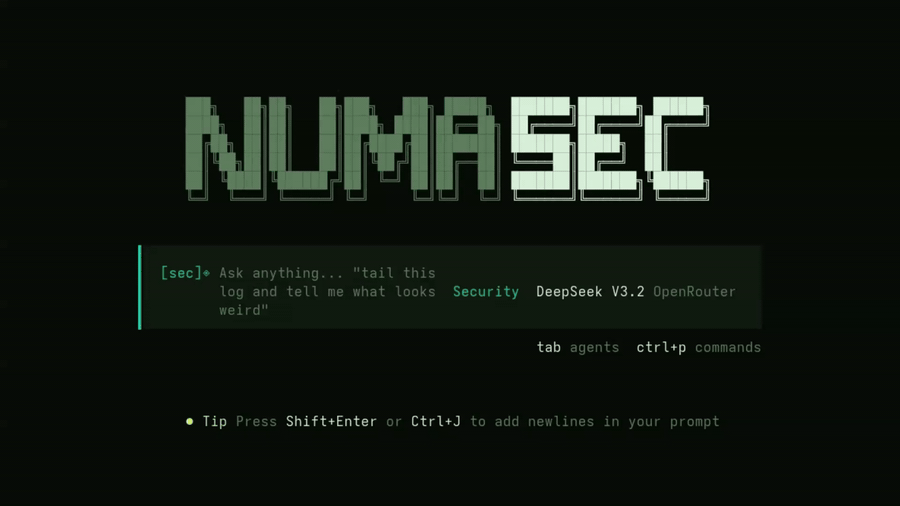

<p align="center">
  
</p>

<h1 align="center">numasec</h1>

<p align="center"><b>The AI cybersecurity agent for your terminal.</b><br/>
<sub>pentest · appsec · osint · hacking · bughunt · ctf · research — one keystroke away.</sub></p>

<p align="center">
  <a href="https://github.com/FrancescoStabile/numasec/actions/workflows/ci.yml"></a>
  <a href="https://github.com/FrancescoStabile/numasec/releases"></a>
  <a href="https://www.npmjs.com/package/numasec"></a>
  <a href="https://hub.docker.com/r/numasec/numasec"></a>
  <a href="LICENSE"></a>
  <a href="https://github.com/FrancescoStabile/numasec/stargazers"></a>
</p>

<p align="center">
  
</p>

---

## Why numasec

The AI-for-security space today is full of two things that don't help an operator:

1. **Scanners** that dump 500 findings and walk away.
2. **Chat wrappers** that sound smart and can't run a single command.

numasec is the third option. A **terminal-native AI agent** that reasons about a target, runs real tools against it, remembers what it learned, and closes the loop with a report you can ship. Built on a fork of opencode, specialised end-to-end for offensive and defensive security work.

> **If Claude Code is an engineer, numasec is an operator.**

---

## Capabilities

<table>
<tr>
<td valign="top">

### 9 slash commands
All workflows start in the TUI with one keystroke:

| Command | What it does |
|---|---|
| `/pwn <target>` | zero-to-pentest in one line — creates the op, sets scope, boots the pentest agent, and starts the engagement |
| `/doctor` | full local probe (tools, network, models, keys) with a live sidebar widget |
| `/teach <topic>` | load a methodology, technique, or CVE into the current session |
| `/opsec <normal\|strict>` | lockdown mode — strict denies every request outside declared scope |
| `/play <slug>` | run a **Play** — a reusable, parameterised attack/defense runbook |
| `/share` | bundle a redacted, sha256-signed deliverable to send to a client |
| `/remediate <finding>` | closes the finding → fix loop with a diff proposal |
| `/init` | drop a `numasec.md` tailored to the directory |
| `/review` | AppSec review of the repo you're sitting in |

</td>
</tr>
<tr>
<td valign="top">

### 7 specialised agents

Switch with `Tab` or `/mode`:

- **pentest** — PTES/OWASP flavoured offensive ops
- **appsec** — DAST/SAST/SCA, secure code review, remediation
- **osint** — passive recon, forensics, link analysis
- **hacking** — CTF, exploit dev, reverse engineering
- **bughunt** — triage-driven bug bounty workflow
- **ctf** — flag-driven challenges with sequential thinking
- **research** — security reading + synthesis

Each one ships its own prompt, tool permissions, and default playbook.

</td>
</tr>
</table>

### Offline methodology & CVE knowledge

numasec ships with a **fully-offline** corpus of MITRE ATT&CK (enterprise + ICS), PTES, OWASP WSTG, and a compact NVD CVE index refreshed weekly via GitHub Actions. Zero API keys, zero internet required for knowledge lookups.

```
> /teach PTES vulnerability-analysis
✔ Loaded PTES §5 into session. 14 techniques, 6 tool recommendations.
```

### Operations — real per-engagement memory

Every engagement is a file (`.numasec/operation/<slug>/numasec.md`) auto-loaded as a system instruction. Target, scope, findings, failed attempts — it all persists across sessions. When `/opsec strict` is on, the runtime guard refuses HTTP/browser requests to out-of-scope hosts **before** they leave the tool.

### Plays — versioned, shareable runbooks

Think "GitHub Actions for pentest workflows". A Play is a YAML-ish script that drives the agent through a reproducible attack/defense flow with parameters, gates, and artefacts. 5 ship in the box (`web-surface`, `appsec-triage`, `pwn`, `osint-passive`, `remediation-loop`) — write your own in any plugin.

### Operations — per-engagement persistent memory

<p align="center">
  
</p>

Every engagement lives in a file — `.numasec/operation/<slug>/numasec.md` — auto-loaded as a system instruction for every session opened in that workspace. Target, scope, findings, dead-ends: it all persists. Switch context with `/operations`, pick up exactly where you left off.

The sidebar keeps you oriented while the agent runs: **Pulse** shows live target/engagement status, **Plan** tracks the agent's todo list in real time (works on any LLM — Claude, GPT-5, Gemini, Ollama), **Activity** streams tool calls as they happen.

### Benchmark harness

Reproducible benchmark runs against a disposable OWASP Juice Shop instance — `web-surface`, `appsec-triage`, `pwn` scenarios — wired into a `bench` GitHub Action so every tag ships with numbers we stand behind.

### Honest secrets, honest permissions

Merged the old `secrets` + `auth-as` palette-cruft into a single `vault` tool backed by a **mode 0600** JSON file. External shell mutations escalate to an explicit `external_directory_mutation` approval — no durable auto-allow. No telemetry, ever.

---

## What it actually does

- **Full shell.** Bash with guardrails when you go out of workspace. Every tool installed on your machine is available — `nmap`, `sqlmap`, `nuclei`, `ffuf`, `metasploit`, `zap`, `burp` replay, your custom exploit. numasec drives them.
- **Native HTTP.** Raw requests, auth, cookies, redirect control, body render, curl replay — no shell-out tax.
- **Real browser.** Playwright-driven Chromium. Navigate, click, fill, screenshot, `evaluate` JS, intercept requests, diff the DOM between states.
- **Attack surface recon.** Crawl, directory fuzz, JS static analysis, port scan, service fingerprint as first-class primitives.
- **OOB callbacks, crypto primitives, net probes, auth profiles.** The pieces a real operator needs that stock chat assistants don't have.
- **Any LLM.** Anthropic, OpenAI, Google, xAI, OpenRouter, Bedrock, GitHub Models, Ollama, any OpenAI-compatible endpoint. The model is the brain, numasec is the hands.

---

## Install

### `npm` (easiest)

```bash
npm i -g numasec
numasec --version
```

### Docker

```bash
docker run -it --rm -v "$PWD:/work" -w /work numasec/numasec:latest
```

### From source

```bash
git clone https://github.com/FrancescoStabile/numasec.git
cd numasec
bun install
cd packages/numasec
bun run build           # single binary in dist/numasec-<platform>/bin/numasec
```

### Recommended offsec deps

numasec shells out to whatever is on your `PATH`. A good kit:

```bash
# Debian/Kali/Ubuntu
apt install nmap sqlmap ffuf gobuster nikto
# macOS
brew install nmap sqlmap ffuf gobuster nikto

# Headless browser (for the browser tool)
npx playwright install chromium
```

---

## First run

```bash
numasec
```

You land in the TUI. Start with:

```
> /pwn http://localhost:3000
```

numasec creates a `pentest` operation, writes a scoped `numasec.md`, spins up the pentest agent, and begins reconnaissance. Interrupt anytime. Switch to `appsec` with `Tab`. Change OPSEC level with `/opsec strict`. Ship the report with `/share`.

### Project context with `.numasec.md`

Drop a `.numasec.md` in any directory and it's auto-loaded next time numasec launches from there:

```markdown
# Target: internal-api.corp.com
- Base: https://internal-api.corp.com/v2
- Auth: Bearer in `Authorization` (POST /auth/login)
- Creds: testuser / testpass123
- Focus: IDOR, privesc, JWT tampering
- Out of scope: DoS, social engineering, rate-limit brute force
```

No flags, no env var, no config. It's just there.

---

## The tool palette

<details>
<summary>25 built-in tools (click to expand)</summary>

**Filesystem + code:** `bash`, `read`, `write`, `edit`, `patch`, `glob`, `grep`, `search`, `code`, `task`, `todo`, `skill`, `fetch`, `invalid`, `question`

**Security primitives:** `httprequest`, `browser`, `scanner`, `crypto`, `net`, `vault`, `interact`, `cve`, `methodology`

**Engagement loop:** `pwn_bootstrap`, `play`, `remediate`, `share`, `opsec`, `doctor`

Every tool is permission-gated, documented, and testable. See [`docs/TOOLS.md`](./docs/TOOLS.md).
</details>

---

## Documentation

| Doc | What it covers |
|---|---|
| [`AGENTS.md`](./AGENTS.md) | Every built-in agent, its prompt, and when to pick it |
| [`docs/MANIFESTO.md`](./docs/MANIFESTO.md) | What numasec is *for*, and what it refuses to be |
| [`docs/OPERATIONS.md`](./docs/OPERATIONS.md) | Per-engagement memory, scope, finding workflow |
| [`docs/PROMPTS.md`](./docs/PROMPTS.md) | Operator-grade prompts, not chat-bot filler |
| [`docs/TOOLS.md`](./docs/TOOLS.md) | Every tool the agent can call, with examples |
| [`docs/PLUGINS.md`](./docs/PLUGINS.md) | Ship your own tools, plays, and skills |
| [`docs/NUMASEC_FILE_FORMAT.md`](./docs/NUMASEC_FILE_FORMAT.md) | `.numasec` replay bundle (JSONL + manifest + evidence, sha256-verifiable) |
| [`CONTRIBUTING.md`](./CONTRIBUTING.md) | How to help |
| [`SECURITY.md`](./SECURITY.md) | Responsible disclosure |

---

## FAQ

**Is this safe to run against production?**
Only with permission. When scope is set, the runtime guard refuses requests to out-of-scope hosts **before** they leave the tool. Turn on `/opsec strict` for engagements where a single stray packet is a problem.

**Does it need a cloud model?**
No. It runs fine on Ollama or any OpenAI-compatible local endpoint. Quality depends on the model; the architecture is provider-agnostic.

**How is this different from Claude Code / opencode?**
Those are coding agents. numasec is an offsec agent. Different prompts, different tools, different methodology, same general class of thing. If you want to write code, use them. If you want to test systems for weaknesses, use this.

**Can I use it for blue team / defense?**
Yes. The `appsec`, `osint`, and default `security` agents are set up for that — threat modelling, secure code review, incident triage. It's not only red.

---

## Development

```bash
bun install                  # from repo root
bun dev                      # launch dev numasec
bun typecheck                # tsgo across the workspace
cd packages/numasec
bun test --timeout 30000     # the suite (1900+ tests)
bun run build                # binary per target
bun run bench:local          # reproducible benchmarks (needs Docker + juice-shop)
```

See [`CONTRIBUTING.md`](./CONTRIBUTING.md) before opening a PR.

---

## License

[MIT](./LICENSE). Do what you want. Don't do crimes.

---

<p align="center">
  Built by <a href="https://www.linkedin.com/in/francesco-stabile-dev">Francesco Stabile</a>
  · <a href="https://x.com/Francesco_Sta">@Francesco_Sta</a>
  <br/><sub>If numasec saved you a shift, <a href="https://github.com/FrancescoStabile/numasec/stargazers">drop a star</a>. It's the only metric we track.</sub>
</p>
