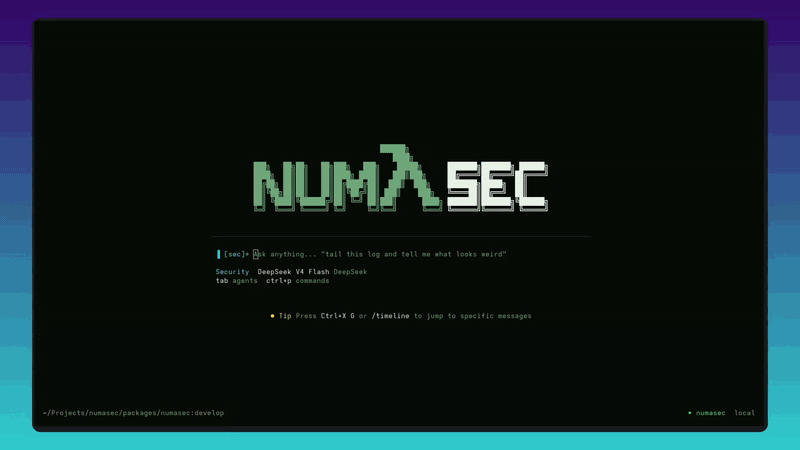

<p align="center">
  
</p>

<p align="center"><b>AI cybersecurity agent. In your terminal.</b></p>

<p align="center">
  <a href="https://github.com/FrancescoStabile/numasec/actions/workflows/ci.yml"></a>
  <a href="https://github.com/FrancescoStabile/numasec/releases"></a>
  <a href="LICENSE"></a>
  <a href="https://github.com/FrancescoStabile/numasec/stargazers"></a>
</p>

<!-- HERO GIF — 15–20s, dark terminal, user types a target, numasec maps surface,
     hits an endpoint, finds something, emits a finding card. Recommended width 900px.
     Replace below when ready. -->
<p align="center">
  
</p>

---

## What this is

numasec is an AI agent for cybersecurity work. It runs in a terminal. You talk to it, it reasons, and then it actually does the work — shell commands, HTTP requests, a real Chromium browser, recon, exploitation, reporting. It doesn't just tell you *what* to do, it does it.

I built this because the AI-for-security space is full of two things that don't help me:

1. **Scanners** that dump five hundred findings and walk away.
2. **Chat wrappers** that sound smart and can't run a single command.

What I wanted was the thing Claude Code is for engineering, applied to offsec. A shell, a browser, a methodology, and a model that knows what it's doing. So I built it.

## Status

**Alpha.** It works. I use it. It will also surprise you in ways that are sometimes good and sometimes not. Bug reports welcome. See `SECURITY.md` if you find something you shouldn't share in public.

## Install

### From source (recommended for now)

```bash
git clone https://github.com/FrancescoStabile/numasec.git
cd numasec
bun install
cd packages/numasec
bun run build
```

The binary lands in `packages/numasec/dist/numasec-<platform>/bin/numasec`. Symlink it into your `PATH` or run it directly.

### Dependencies you probably want

numasec can use any tool that exists on your machine. For the built-in browser tool you need a headless Chromium:

```bash
npx playwright install chromium
```

For classic offsec work, install the usual suspects with whatever package manager you have:

```bash
apt install nmap sqlmap ffuf gobuster    # Debian/Kali/Ubuntu
brew install nmap sqlmap ffuf gobuster   # macOS
```

Nothing else is required. No pip, no virtualenv, no Python at all.

## First run

```bash
numasec
```

You land in the TUI. Type something like you'd write to a teammate:

```
> Pentest http://localhost:3000. It's a Juice Shop instance, focus on
> injection and broken access control, go.
```

numasec will map the surface, probe endpoints, chain findings, and when you ask for it produce a report. You can interrupt, redirect, push back, take over. It's a conversation, not a script.

Switch agent with `/mode` or `Tab`:

```
/mode pentest    penetration testing (PTES/OWASP flavored)
/mode appsec     code review, SAST, dependency analysis
/mode osint      open-source intelligence, recon, forensics
/mode hacking    CTF, exploit dev, reverse engineering
/mode security   default general-purpose operator (Jarvis mode)
```

<!-- MODE-SWITCH GIF — a 6–8s clip showing Tab cycling through the agents,
     each with its own glyph and color accent. -->
<p align="center">
  
</p>

## What it actually does

- **Full shell.** Bash, with guardrails when you go out of workspace. Whatever is installed is available — nmap, sqlmap, nuclei, ffuf, metasploit, wireshark, your homemade exploit script, you name it.
- **Native HTTP client.** Raw requests, auth, cookies, redirect control, body rendering, curl replay — without shelling out.
- **Real browser.** Playwright-driven Chromium. Navigate, click, fill, screenshot, evaluate JS, intercept requests, diff the DOM between states.
- **Attack surface recon.** Crawl, directory fuzz, JS static analysis, port scanning, service fingerprinting as first-class primitives.
- **OOB callbacks, secrets, crypto, net probes, auth profiles.** The pieces a real operator needs that stock chat assistants don't have.
- **Operations.** A per-engagement markdown fascicule (`numasec.md`) auto-loaded as a system instruction so the agent remembers target, scope, findings, and failed attempts across sessions. Runtime scope enforcement means the agent *cannot* touch hosts you didn't authorize. See [`docs/OPERATIONS.md`](./docs/OPERATIONS.md).
- **Any LLM.** Anthropic, OpenAI, Google, xAI, OpenRouter, Bedrock, GitHub Models, Ollama, any OpenAI-compatible endpoint. The model is the brain, numasec is the hands.

<!-- ATTACK-CHAIN GIF — 10–15s showing numasec discovering an IDOR, chaining it
     into a privilege escalation, and dropping an observation with evidence. -->
<p align="center">
  
</p>

## Project context with `.numasec.md`

Drop a `.numasec.md` in any directory to give numasec persistent context when it's launched from there:

```markdown
# Target: internal-api.corp.com
- Base: https://internal-api.corp.com/v2
- Auth: Bearer in `Authorization` (grab from POST /auth/login)
- Creds: testuser / testpass123
- Focus: IDOR, privesc, JWT tampering
- Out of scope: DoS, social, rate-limit brute force
```

It's loaded automatically. No flags, no env var, no config. It's just there.

## Documentation

- [`AGENTS.md`](./AGENTS.md) — what each built-in agent is, how it thinks
- [`docs/MANIFESTO.md`](./docs/MANIFESTO.md) — what numasec is *for*, and what it refuses to be
- [`docs/OPERATIONS.md`](./docs/OPERATIONS.md) — per-engagement memory (`numasec.md`), scope enforcement, finding workflow
- [`docs/PROMPTS.md`](./docs/PROMPTS.md) — the operational prompts that make the agents act like operators, not chatbots
- [`docs/TOOLS.md`](./docs/TOOLS.md) — every tool the agent can call
- [`docs/PLUGINS.md`](./docs/PLUGINS.md) — how to extend with your own tools
- [`docs/NUMASEC_FILE_FORMAT.md`](./docs/NUMASEC_FILE_FORMAT.md) — the `.numasec` replay format (JSONL + manifest + evidence bundle, sha256 verifiable)
- [`CONTRIBUTING.md`](./CONTRIBUTING.md) — how to help
- [`SECURITY.md`](./SECURITY.md) — responsible disclosure

## FAQ

**Is this safe to run against production?**
Only if you have permission. numasec is an agent — it does real things. Use operations + scope boundaries before pointing it at anything you care about. When scope is set, the runtime guard refuses requests to out-of-scope hosts before they leave the tool.

**Does it need a cloud model?**
No. It runs fine on Ollama or any OpenAI-compatible local endpoint. Quality obviously depends on the model, but the architecture is provider-agnostic.

**How is this different from Claude Code / opencode / etc.?**
Those are coding agents. numasec is an offsec agent. Different prompts, different tools, different methodology, same general class of thing. If you want to write code, use them. If you want to test systems for weaknesses, use this.

**Can I use it for defense / blue team?**
Yes. The `security` and `appsec` agents are set up for that — architecture review, threat modeling, code review, incident response helper. It's not only red.

**Why TypeScript and not Python?**
Because Bun packages to a single statically-linked binary and I'd rather ship one file than a pip wheel and its thirty transitive dependencies. Also because the rest of the AI-terminal ecosystem lives here now, and that's where the reusable pieces are.

## Development

```bash
bun install                 # from repo root
bun dev                     # launch in dev mode
bun typecheck               # tsgo across the workspace
cd packages/numasec
bun test --timeout 30000    # run the suite
bun run build               # build binary
```

See [`CONTRIBUTING.md`](./CONTRIBUTING.md) before opening a PR.

## License

[MIT](./LICENSE).

---

<p align="center">
  Built by <a href="https://www.linkedin.com/in/francesco-stabile-dev">Francesco Stabile</a>
  · <a href="https://x.com/Francesco_Sta">@Francesco_Sta</a>
</p>
