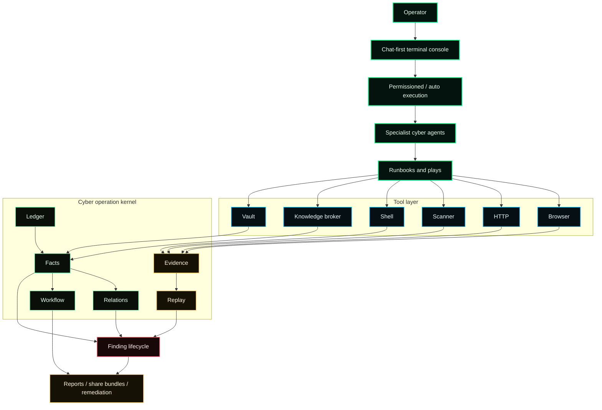
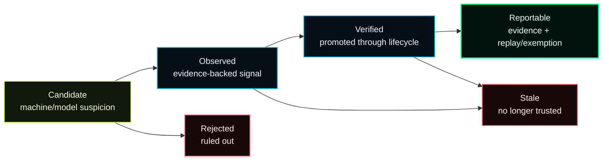

<p align="center">
  
</p>

<h1 align="center">numasec</h1>

<p align="center">
  <b>The security-native AI agent.</b>
</p>

<p align="center">
  Security deserves its own terminal agent: scoped operations, real tools, evidence, replay, runbooks, and reports from one operator console.
</p>

<p align="center">
  <a href="https://github.com/FrancescoStabile/numasec/actions/workflows/ci.yml"></a>
  <a href="https://github.com/FrancescoStabile/numasec/releases"></a>
  <a href="https://www.npmjs.com/package/numasec"></a>
  <a href="https://www.npmjs.com/package/numasec"></a>
  <a href="https://github.com/FrancescoStabile/numasec/stargazers"></a>
  <a href="LICENSE"></a>
</p>

<p align="center">
  <a href="#why-numasec">Why</a> |
  <a href="#demo">Demo</a> |
  <a href="#product-tour">Product Tour</a> |
  <a href="#what-it-does">What It Does</a> |
  <a href="#install">Install</a> |
  <a href="#commands">Commands</a> |
  <a href="#architecture">Architecture</a> |
  <a href="#quality-bar">Quality Bar</a> |
  <a href="#roadmap">Roadmap</a>
</p>

---

## Why numasec

Coding has terminal agents.

Cyber security still runs on scattered evidence: scanners in one pane, browser tabs in another, shell history somewhere else, screenshots on disk, notes in markdown, and a report that has to be reconstructed after the fact.

numasec is built around a different premise:

> The AI agent should not just talk about security. It should operate in a cyber-ready environment, use real local tools, preserve evidence, keep operation state, and only report claims it can support.

It is not a generic coding assistant. It is not a flat scanner wrapper. It is not "ask an LLM to run nmap".

numasec is a cyber operator: the LLM is wrapped with terminal access, browser automation, HTTP execution, installed security tools, operation memory, provenance, replay material, permission modes, and report generation.

The goal is simple: make AI useful for real AppSec, pentest, bug bounty, OSINT, CTF, and security research workflows without losing the discipline that makes security work trustworthy.

## Why now

AI agents are moving from autocomplete into operating systems for work. Coding agents can read repos, edit files, run tests, and ship patches from the terminal.

Security needs the same shift, but the wrapper has to be different.

Cyber work needs scope. It needs opsec. It needs a browser, raw HTTP, installed tools, target memory, evidence, replay, finding states, and report discipline. A generic coding agent can help, but it was not designed around those constraints.

numasec is the open-source attempt to build that missing layer: not another scanner, not another chatbot, but the terminal-native workbench for AI-assisted security operations.

## Demo

<p align="center">
  <a href="assets/demo.mp4">
    
  </a>
  <br />
  <sub>Click the preview for the full terminal recording.</sub>
</p>

## Product tour

numasec is designed to feel like a cyber operator console, not a generic chat window with a pile of tools attached.

<p align="center">
  
</p>

Start from a chat-first terminal surface, then move into scoped operation work without leaving the shell. The UI keeps the important things close: current agent, provider, command palette, operation context, and the next action the operator can take.

<p align="center">
  
</p>

The findings lens is where numasec stops being "LLM output" and becomes an operator tool. Each row is a claim with a lifecycle state, severity, evidence count, replay status, and a next action. Candidate signals can stay candidates. Rejected findings stay visible. Reportable findings must be backed by proof.

The right sidebar keeps the engagement honest while you work: scope, opsec, runbook progress, tool readiness, plan state, activity, evidence volume, replay coverage, and final report status. You do not have to scroll through chat to know whether the operation is actually ready.

<p align="center">
  
</p>

Switch between specialist cyber agents when the work changes. Use Security for broad triage, AppSec for code and application review, Pentest for scoped offensive operations, OSINT for public-source investigation, and Hacking for raw lab-style work. The point is not "more personas"; it is keeping the model inside the right operating posture for the job.

<p align="center">
  
</p>

Operations are durable engagements. Name them, rename them, resume them, switch between them, and export them without turning chat history into canonical state.

## What it does

numasec turns a terminal session into an operation.

| Capability | What it means in practice |
| --- | --- |
| Cyber operations | Start scoped AppSec or Pentest work with an operation label, target, autonomy posture, opsec policy, and durable state. |
| Operation console | Keep scope, proof, runbook progress, tool readiness, activity, and report status visible while the agent works. |
| Runbooks | Use semantic cyber capsules such as AppSec triage, web surface mapping, API surface, auth surface, and network surface. |
| Real tools | Drive installed tools and adapters from the terminal: browser, HTTP, scanner, Cyber Knowledge Broker, vault, net, crypto, evidence, finding, report, and more. |
| Finding lenses | Separate candidate, observed, verified, rejected, stale, and reportable claims instead of flattening everything into scanner noise. |
| Evidence-first claims | Store tool output, browser artifacts, HTTP traces, screenshots, and supporting files before turning signals into durable findings. |
| Replay-aware reporting | Reportable findings require evidence plus replay material, or an explicit structured replay exemption. |
| Operator control | Run in permissioned mode with allow/deny/allow-always, or auto mode inside the operation boundary. |
| Deliverables | Build operation reports from the kernel state instead of trusting chat transcript confidence. |

## Built for

- bug bounty hunters who need faster triage without losing proof
- pentesters who want an AI operator inside their terminal workflow
- AppSec engineers who need evidence-backed reports, not scanner noise
- security researchers who live across shell, browser, HTTP, vulnerability intelligence, tradecraft, and notes
- CTF players who want a structured agent loop without giving up tool control

numasec is designed for authorized security work. Keep scope explicit and use it only where you have permission to test.

## The operator loop

```mermaid
flowchart LR
  target["Target"] --> operation["Operation"]
  operation --> posture["Scope + Opsec + Autonomy"]
  posture --> runbook["Runbook capsule"]
  runbook --> tools["Cyber tools"]

  tools --> evidence["Evidence store"]
  evidence --> observations["Observations"]
  observations --> findings["Finding lifecycle"]
  findings --> proof["Replay / proof policy"]
  proof --> report["Report + handoff"]

  operation -. kernel source of truth .-> kernel["Cyber kernel"]
  kernel --> evidence
  kernel --> findings
  kernel --> report

  classDef primary fill:#04130d,stroke:#00ff88,color:#eafff4,stroke-width:2px;
  classDef secondary fill:#061014,stroke:#00c2ff,color:#eaf9ff,stroke-width:1.5px;
  classDef proofNode fill:#151104,stroke:#ffcc66,color:#fff7df,stroke-width:1.5px;
  classDef findingNode fill:#190808,stroke:#ff5f6d,color:#fff0f0,stroke-width:1.5px;

  class target,operation,posture,runbook,tools primary;
  class evidence,observations,kernel secondary;
  class proof,report proofNode;
  class findings findingNode;
```



The key difference is that the operation is not just a markdown file or a chat transcript. The cyber kernel is the source of truth.

## Install

### npm

```bash
npm install -g numasec
numasec
```

### Bun

```bash
bun add -g numasec
numasec
```

### Docker

```bash
docker run -it --rm -v "$PWD:/work" -w /work francescostabile/numasec:latest
```

### From source

```bash
git clone https://github.com/FrancescoStabile/numasec.git
cd numasec
bun install
cd packages/numasec
bun run build
```

## Quick start

```bash
numasec
```

Then try:

```text
/doctor
/mode appsec
/pwn http://localhost:3000
/runbook run web-surface http://localhost:3000
/share
```

For best results, run numasec in a workspace directory and keep the target scope explicit.

## Commands

```text
/pwn <target>                  classify a target, create an operation, choose a capsule
/runbook list                  list available runbook capsules
/runbook run web-surface <x>   map a web target through the primary runbook surface
/runbook run appsec-web-triage <x>
/operations                    inspect or switch active operations
/mode appsec                   switch specialist agent
/mode pentest                  switch specialist agent
/agents                        switch agent from the TUI
/doctor                        inspect runtime, local tools, and capability readiness
/opsec strict                  enforce strict operation scope
/models                        switch provider/model
/share                         export the active operation bundle
/remediate <observation_id>    turn an observation into advice or patch scaffolding
```

## Tool surface

numasec exposes normal agent primitives and cyber-specific tools through one operator harness.

```text
bash, read, write, edit, apply_patch, grep, glob, task, webfetch, websearch,
codesearch, skill, http_request, browser, scanner, crypto, net, vault, interact,
methodology, cve,
runbook, play, pwn_bootstrap, appsec_probe, workspace, scope, opsec, identity,
evidence, observation, knowledge, finding, report, autonomy, share, remediate,
analyze, doctor
```

`knowledge` is the preferred cyber research surface. It routes vulnerability intelligence, methodology, tradecraft, exploit signals, and installed tool docs through one provenance-aware broker. For observed components (`nginx 1.18.0`, `OpenSSH_8.2p1`, package specs), it separates possibility from applicability with version-range matching, KEV/EPSS enrichment, and safe next actions. `cve` remains as a compatibility alias for CVE-style lookups.

Local tools make numasec stronger. If these are installed, the agent can use or reason around them:

```bash
# Debian / Kali / Ubuntu
apt install nmap sqlmap ffuf gobuster nikto nuclei trivy checksec

# macOS
brew install nmap sqlmap ffuf gobuster nikto nuclei trivy checksec
```

Use `/doctor` to see what is available, degraded, or missing on the current machine.

## How numasec is different

| Category | What usually happens | What numasec is trying to do |
| --- | --- | --- |
| Generic coding agents | Strong at code edits, weak at cyber operation state and proof workflow. | Keep the terminal-agent feel, but wrap it in cyber scope, tools, evidence, replay, and reports. |
| Scanner wrappers | Produce findings fast, but often lose context, proof, and operator reasoning. | Treat scanner output as evidence and candidate facts inside a larger operation. |
| MCP tool servers | Expose tools to LLMs, but often leave memory, lifecycle, and reporting to the user. | Provide a complete operator loop: runbook, operation kernel, findings, evidence, replay, deliverable. |
| Manual pentest notes | Flexible but fragile: screenshots, shell history, notes, and reports drift apart. | Keep human-readable context as a derived view over kernel-backed state. |

## Models and providers

numasec is model-agnostic. It wraps the model you choose with a cyber-ready runtime.

Supported provider families include OpenAI, Anthropic, Google, xAI, Bedrock, OpenRouter, Ollama, Vercel AI Gateway, OpenAI-compatible endpoints, and other providers supported through the local model stack.

The product bet is not "one model will solve cyber." The bet is that strong models become much more useful when they are placed inside the right operational environment.

## Architecture

numasec wraps the model instead of trying to change the model.



### Kernel-first state

An operation is stored as ledger events, projected cyber facts, relations, evidence, replay artifacts, workflow state, and deliverables.

`numasec.md` can exist as a derived context pack, but it is not canonical state.

### Finding lifecycle

numasec separates weak signals from claims:



Reportable means evidence-backed and replay-backed, or evidence-backed with a structured replay exemption.

### Runbooks over raw tools

The primary surface is `runbook`: semantic capsules that coordinate lower-level plays and tools.

Benchmark-backed today:

- `appsec-web-triage`
- `web-surface`
- `pwn` / Pentest starter flow

Maturity-labeled surfaces:

- repository AppSec triage (`appsec-triage`)
- API surface
- auth surface
- network surface
- OSINT target work
- CTF warmup
- cloud posture
- container surface
- IaC triage
- binary triage

## Quality bar

numasec is built around a strict rule: the product should not claim more than the operation state can support.

Benchmark-backed domains:

- AppSec
- Pentest

The gate is intentionally evidence-oriented:

- operation state must exist
- workflow state must complete
- observations must be projected
- findings must not overclaim
- reports must not promote unsupported claims
- AppSec/Pentest benchmark runs are manual evidence for public maturity claims

What numasec does not claim yet:

- it is not equally mature across every cyber domain
- it does not magically prove exploitability without evidence
- it does not bundle every security binary
- it is not a replacement for authorization, scope, or operator judgment

That honesty is part of the product. Security tools lose trust when they confuse confidence with proof.

## Roadmap

The long-term vision is a multi-domain cyber operator:

- AppSec: DAST, SAST, SCA, authz, API, remediation
- Pentest: recon, web, network, credentials, evidence, reporting
- OSINT: passive target intelligence with provenance
- CTF and labs: structured exploit/reversing/forensics workflows
- Cloud/container/IaC: adapter-backed posture and misconfiguration triage
- Team operations: shareable operation bundles, redaction, handoff, review

The short-term rule is stricter: every domain that claims maturity needs proof semantics and manual benchmark evidence.

## Documentation

- [Operations](docs/OPERATIONS.md)
- [Tool reference](docs/TOOLS.md)
- [Operation file format](docs/NUMASEC_FILE_FORMAT.md)
- [Changelog](CHANGELOG.md)
- [Contributing](CONTRIBUTING.md)
- [Security](SECURITY.md)

## Development

```bash
bun install
bun typecheck

cd packages/numasec
bun test --timeout 30000
bun run build
bun run bench:cyber --domain appsec
bun run bench:cyber --domain pentest
```

Do not run package tests from the repo root. numasec uses Bun-first package-local workflows.

## Contributing

numasec is looking for contributions that make the operator better:

- new runbooks with clear scope and proof semantics
- better parsers that turn tool output into provenance-backed facts
- adapters for real security tools
- benchmark scenarios that are hard to fake
- report templates that reduce overclaiming
- TUI polish that makes operations easier to read under pressure

If a change creates a confirmed security claim, it needs evidence. If a finding is reportable, it needs replay or a structured exemption.

## Community

The best feedback is real operator feedback:

- what target class you tested
- what numasec helped you do faster
- where it overclaimed, stalled, or missed context
- which local tools you want first-class adapters for
- which runbook should exist next

Use GitHub issues and discussions for bugs, ideas, security workflow feedback, and release questions.

## Star the project

If you believe cyber security deserves a serious terminal-native AI operator, star the repo and share what you are using it for.

This project is early, but the direction is clear: make AI agents useful for real security work by giving them the environment, memory, tools, and proof discipline the domain requires.

## License

[MIT](./LICENSE). Use numasec for authorized security work, research, education, and defensive operations.

<p align="center">
  Built by <a href="https://www.linkedin.com/in/francesco-stabile-dev">Francesco Stabile</a>
  | <a href="https://x.com/Francesco_Sta">@Francesco_Sta</a>
  <br/><sub>If numasec helps you, <a href="https://github.com/FrancescoStabile/numasec/stargazers">drop a star</a> and share the workflow.</sub>
</p>
