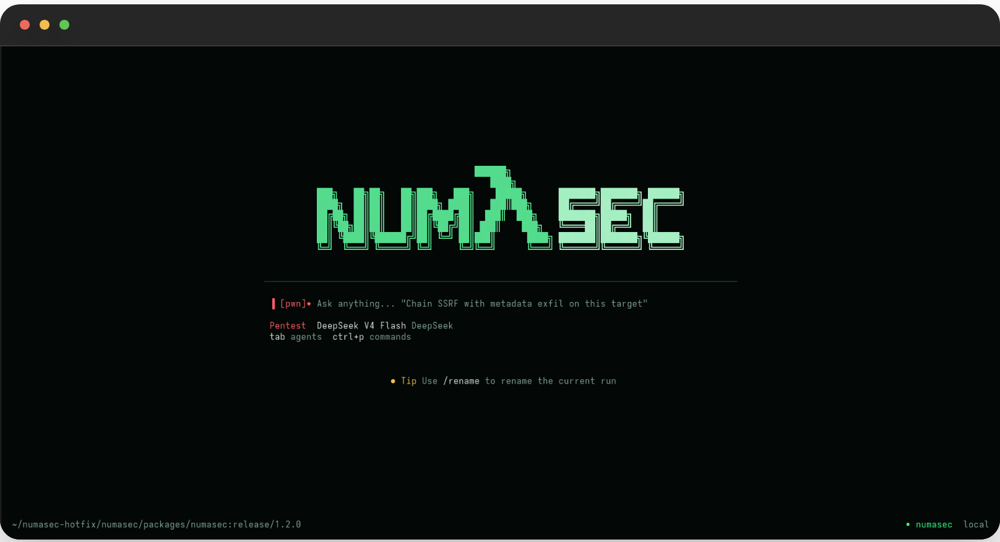
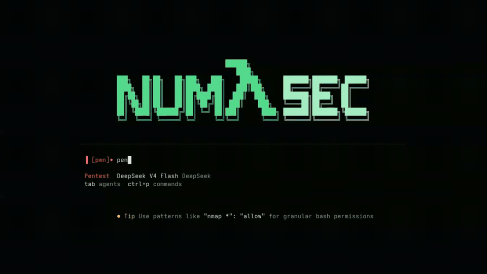
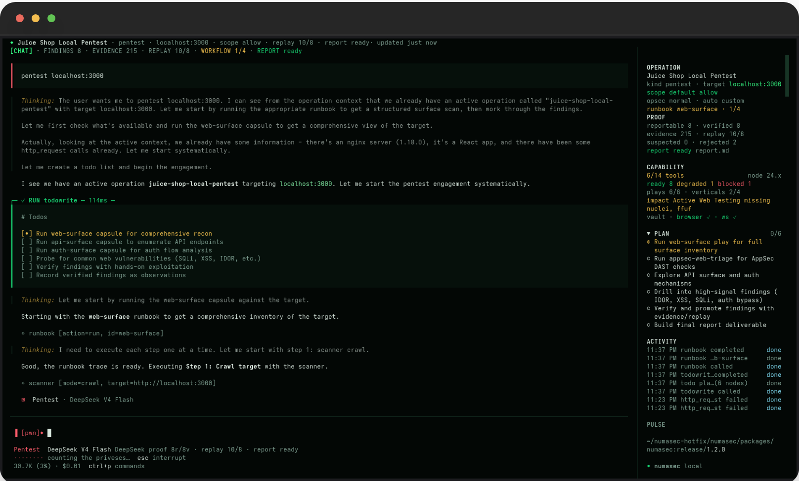
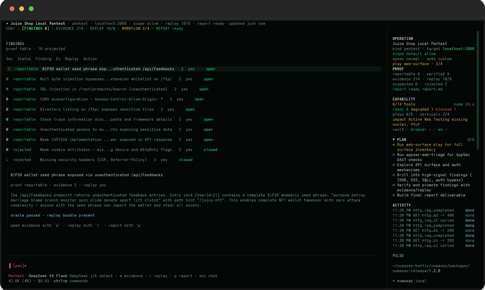
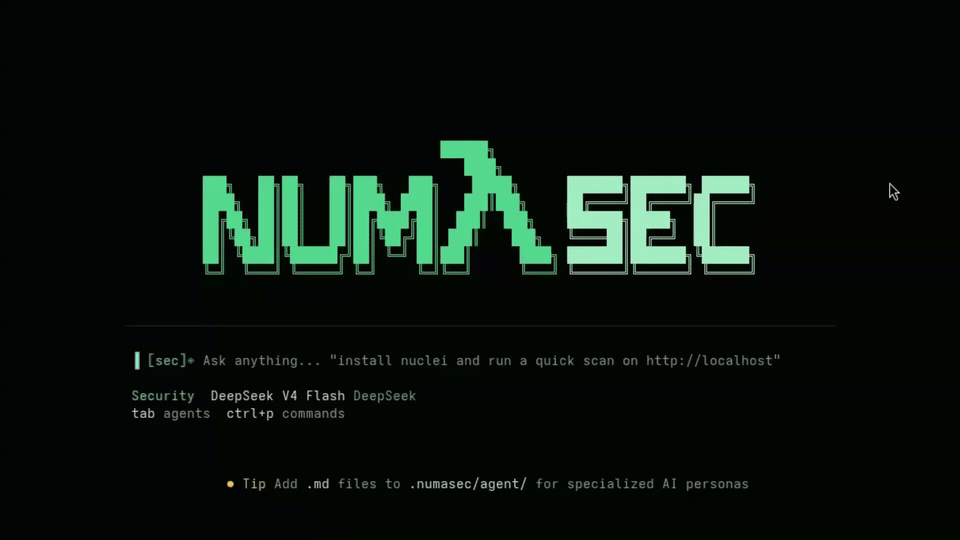
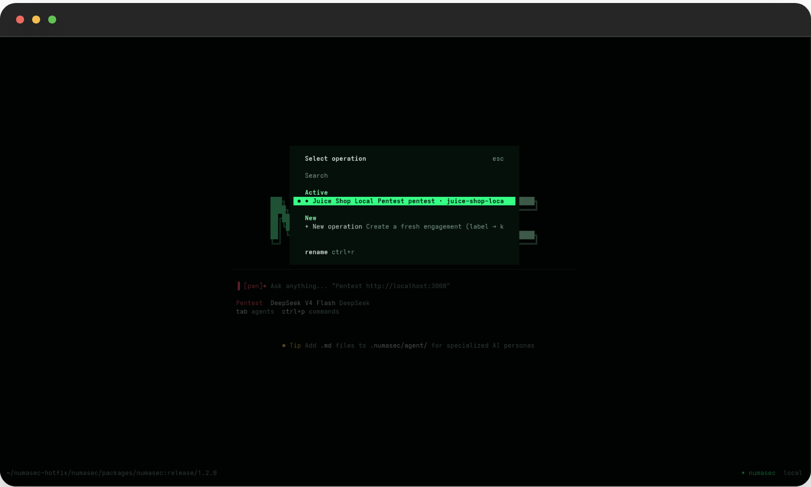
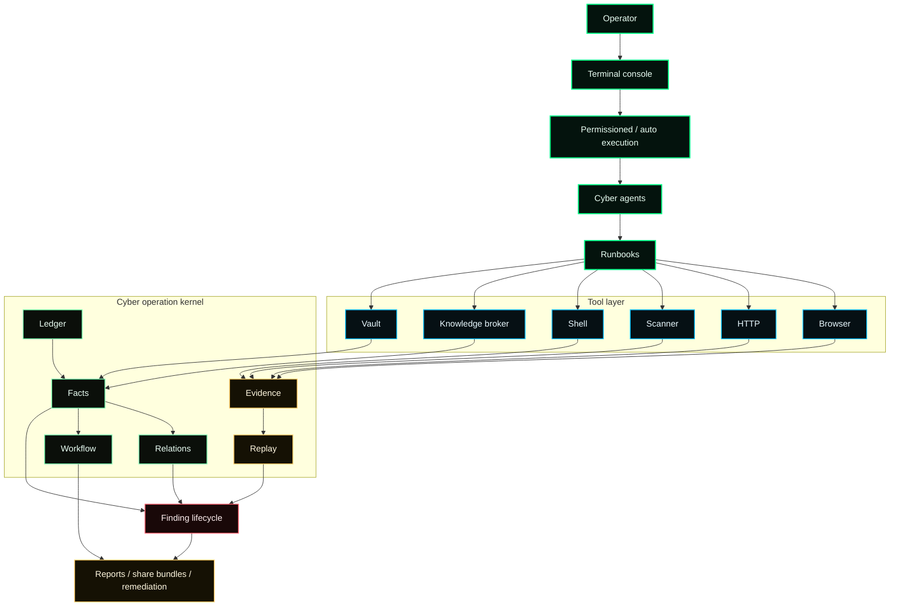
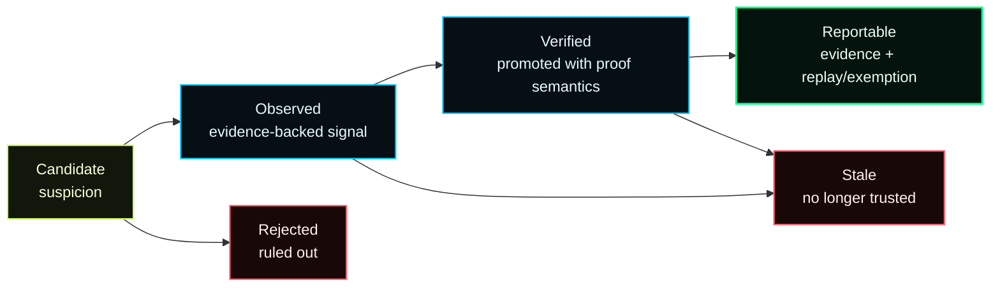

<p align="center">
  
</p>

<h1 align="center">numasec</h1>

<p align="center">
  <b>The security-native AI Agent.</b>
</p>

<p align="center">
  Give an AI agent the environment security work actually needs: <b>scope, opsec, local tools, evidence, replay, findings, cyber knowledge, and reports</b>.
</p>

<p align="center">
  <a href="https://github.com/FrancescoStabile/numasec/actions/workflows/ci.yml"></a>
  <a href="https://github.com/FrancescoStabile/numasec/releases"></a>
  <a href="https://www.npmjs.com/package/numasec"></a>
  <a href="https://www.npmjs.com/package/numasec"></a>
  <a href="https://github.com/FrancescoStabile/numasec/stargazers"></a>
  <a href="LICENSE"></a>
</p>

<p align="center">
  <a href="#why-numasec">Why</a> |
  <a href="#demo">Demo</a> |
  <a href="#product-tour">Product Tour</a> |
  <a href="#what-it-does">What It Does</a> |
  <a href="#install">Install</a> |
  <a href="#commands">Commands</a> |
  <a href="#architecture">Architecture</a> |
  <a href="#quality-bar">Quality Bar</a> |
  <a href="#roadmap">Roadmap</a>
</p>

---

## Why numasec

AI coding agents got a real terminal workflow. They can inspect a repo, edit files, run tests, and ship a patch.

Security work is different. A good operator does not just "find bugs". They keep scope clear, choose tools carefully, preserve evidence, separate suspicion from proof, replay what matters, and write reports that can survive review.

That is the gap numasec is built for.

> **numasec is a cyber operator harness:** it wraps the model with a terminal, browser, HTTP execution, installed security tools, operation memory, evidence storage, replay material, permission modes, cyber knowledge, and report generation.

The model can think, hypothesize, search, and decide what to try next. **numasec makes the work operational.** It keeps the target, scope, artifacts, findings, and report state together so the agent is not just producing fluent security prose.

It is built for authorized AppSec, pentest, bug bounty, OSINT, CTF, and security research workflows where **proof matters more than confidence**.

## Why now

AI agents are becoming normal for software work. Security needs the same shift, but it cannot reuse the same wrapper unchanged.

Cyber work needs things a generic assistant does not naturally carry:

- **scope and opsec**, because the difference between useful and reckless is often the boundary;
- **local tool awareness**, because security work depends on the machine you are actually on;
- **evidence and replay**, because a finding without proof is just a claim;
- **fresh cyber knowledge**, because CVEs, advisories, exploit signals, and tool behavior move faster than model training;
- **finding lifecycle**, because candidate, observed, verified, rejected, stale, and reportable are not the same thing.

numasec is the open-source attempt to build that missing layer: **a terminal-native workbench for AI-assisted security operations**, not another scanner dashboard and not a generic chat window with a few tools bolted on.

## Demo

<p align="center">
  <a href="assets/demo.mp4">
    
  </a>
  <br />
  <sub>Click the preview for the full terminal recording.</sub>
</p>

## Product tour

numasec starts as a chat-first terminal agent, then turns into an operation console as soon as real security work begins.

<p align="center">
  
</p>

The usage stays simple on purpose, you get the model, current agent, command palette, working directory, and prompt, once you start work, numasec keeps the engagement visible.

<p align="center">
  
</p>

The findings lens is where the product becomes more than "LLM output": each claim has a state, severity, evidence count, replay status, and next action. **Weak signals can stay weak. Rejected claims remain visible. Reportable findings need proof.**

The sidebar keeps the important pressure points in view: target, scope, opsec posture, runbook progress, evidence volume, replay coverage, local tool readiness, recent activity, and report status. You should not have to dig through chat history to know the operation informations.

<p align="center">
  
</p>

Switch agents when the work changes: Security is the general operator, AppSec focuses on application review, Pentest keeps scoped offensive work disciplined, OSINT handles public-source investigation, Hacking is for raw lab-style work. The point is not roleplay, it is keeping the model in the right operating posture.

<p align="center">
  
</p>

Operations are durable engagements: Name them, rename them, resume them, share them, and come back later without pretending that a markdown note or chat transcript is the source of truth.

## What it does

numasec turns a terminal session into a cyber operation.

| Capability | Why it matters |
| --- | --- |
| **Scoped operations** | Work starts with a target, operation name, autonomy posture, opsec policy, and durable state instead of an unbounded chat. |
| **Operation console** | Findings, evidence, replay, workflow, activity, local tool readiness, and report status stay visible while the agent works. |
| **Runbooks** | Named cyber workflows keep the agent from turning security work into random tool calls. |
| **Local tools** | numasec uses the tools installed on your machine and degrades visibly when something is missing. |
| **Evidence-first findings** | Tool output, HTTP traces, browser artifacts, screenshots, files, and observations are stored before claims become durable findings. |
| **Finding lifecycle** | Candidate, observed, verified, rejected, stale, and reportable are handled as different states, not flattened into noise. |
| **Replay-aware reporting** | A reportable finding needs evidence plus replay material, or an explicit structured replay exemption. |
| **Cyber knowledge broker** | Vulnerability intelligence, KEV/EPSS, package advisories, methodology, tradecraft, exploit signals, and tool docs flow through one provenance-aware surface. |
| **Operator control** | Use permissioned mode with allow, deny, and allow-always, or switch to auto mode inside the operation boundary. |
| **Deliverables** | Reports and share bundles are built from operation state, not from model confidence. |

## Built for

- **Bug bounty hunters** who want faster triage without losing proof.
- **Pentesters** who want an AI operator inside the terminal workflow they already use.
- **AppSec engineers** who need evidence-backed reports instead of scanner noise.
- **Security researchers** who move between shell, browser, HTTP, advisories, tradecraft, and notes.
- **CTF and lab users** who want structure without giving up direct tool control.

numasec is for authorized security work. Keep scope explicit and use it only where you have permission to test.

## The operator loop

```mermaid
flowchart LR
  target["Target"] --> operation["Operation"]
  operation --> posture["Scope + opsec + autonomy"]
  posture --> runbook["Runbook"]
  runbook --> tools["Local cyber tools"]

  tools --> evidence["Evidence"]
  evidence --> observations["Observations"]
  observations --> findings["Findings"]
  findings --> proof["Replay / proof"]
  proof --> report["Report"]

  operation -. source of truth .-> kernel["Cyber kernel"]
  kernel --> evidence
  kernel --> findings
  kernel --> report

  classDef primary fill:#04130d,stroke:#00ff88,color:#eafff4,stroke-width:2px;
  classDef secondary fill:#061014,stroke:#00c2ff,color:#eaf9ff,stroke-width:1.5px;
  classDef proofNode fill:#151104,stroke:#ffcc66,color:#fff7df,stroke-width:1.5px;
  classDef findingNode fill:#190808,stroke:#ff5f6d,color:#fff0f0,stroke-width:1.5px;

  class target,operation,posture,runbook,tools primary;
  class evidence,observations,kernel secondary;
  class proof,report proofNode;
  class findings findingNode;
```



The important bit: **the operation is not a chat transcript**, numasec keeps a kernel-backed record of what happened, what was observed, what was proven, and what is safe to report.

## Install

### npm

```bash
npm install -g numasec
numasec
```

### Bun

```bash
bun add -g numasec
numasec
```

### Docker

```bash
docker run -it --rm -v "$PWD:/work" -w /work francescostabile/numasec:latest
```

### From source

```bash
git clone https://github.com/FrancescoStabile/numasec.git
cd numasec
bun install
cd packages/numasec
bun run build
```

## Quick start

```bash
numasec
```

Then try:

```text
/doctor
/mode appsec
/pwn http://localhost:3000
/runbook run web-surface http://localhost:3000
/share
```

For best results, run numasec from the workspace you are testing and keep the target scope explicit.

## Commands

```text
/pwn <target>                  create a scoped pentest operation for a target
/runbook list                  show available cyber workflows
/runbook run web-surface <x>   map routes, forms, browser surface and candidate risks
/runbook run appsec-web-triage <x>
/operations                    inspect, rename, resume or switch operations
/mode appsec                   switch to the AppSec agent
/mode pentest                  switch to the Pentest agent
/agents                        open the agent switcher
/doctor                        inspect local tool readiness and degraded capabilities
/opsec strict                  tighten operation boundaries
/models                        switch provider or model
/share                         export the active operation bundle
/remediate <observation_id>    turn an observation into remediation guidance
```

## Tool surface

The model sees a small set of useful operator surfaces. Under the hood, numasec connects them to local tools, parsers, evidence storage, and kernel state.

Core surfaces:

- **terminal and files:** `bash`, `read`, `write`, `edit`, `apply_patch`, `grep`, `glob`
- **web and application testing:** `http_request`, `browser`, `scanner`, `appsec_probe`
- **operation control:** `runbook`, `pwn_bootstrap`, `scope`, `opsec`, `autonomy`, `identity`
- **proof workflow:** `evidence`, `observation`, `finding`, `report`, `share`, `remediate`
- **security intelligence:** `knowledge`, `methodology`, `cve`
- **environment:** `doctor`, `workspace`, `vault`, `net`, `crypto`, `analyze`

`knowledge` is the preferred cyber research surface. It routes vulnerability intelligence, package advisories, methodology, tradecraft, exploit signals, and installed tool docs through one provenance-aware broker. For observed components like `nginx 1.18.0`, `OpenSSH_8.2p1`, or `npm:react@18.2.0`, it separates **possibility** from **applicability**, enriches with KEV/EPSS where available, and suggests safe next actions without turning intelligence into a finding.

`cve` remains as a compatibility alias for CVE-style lookup. New cyber research should use `knowledge`.

Local tools make numasec stronger. If these are installed, the agent can use or reason around them:

```bash
# Debian / Kali / Ubuntu
apt install nmap sqlmap ffuf gobuster nikto nuclei trivy checksec

# macOS
brew install nmap sqlmap ffuf gobuster nikto nuclei trivy checksec
```

Use `/doctor` to see what is available, degraded, or missing on the current machine.

## How numasec is different

| Compared with | The usual problem | What numasec adds |
| --- | --- | --- |
| **Generic terminal agents** | They are strong at reasoning and shell work, but they do not naturally track cyber scope, proof, replay, and reportability. | A cyber-specific operation layer around the model. |
| **Scanner wrappers** | They produce output fast, but often lose context and blur weak signals with real findings. | Scanner output becomes evidence and candidate facts inside an operation. |
| **Tool servers** | They expose capabilities, then leave memory, lifecycle, and reporting to the user. | A full operator loop: runbook, kernel state, evidence, findings, replay, report. |
| **Manual notes** | Flexible, but screenshots, shell history, browser state, and report claims drift apart. | Human-readable context is derived from operation state instead of replacing it. |

## Models and providers

numasec is model-agnostic. It wraps the model you choose with a cyber-ready runtime.

Supported provider families include OpenAI, Anthropic, Google, xAI, Bedrock, OpenRouter, Ollama, Vercel AI Gateway, OpenAI-compatible endpoints, and other providers supported through the local model stack.

The bet is not that one model magically solves security. **The bet is that strong models become far more useful when they operate inside the right security environment.**

## Architecture

numasec wraps the model instead of trying to change the model.



### Kernel-first state

An operation is stored as ledger events, projected cyber facts, relations, evidence, replay artifacts, workflow state, and deliverables.

`numasec.md` can exist as a derived context pack. It is useful for orientation, but it is not canonical state.

### Finding lifecycle

numasec separates signal from proof:



Reportable means evidence-backed and replay-backed, or evidence-backed with a structured replay exemption. **The model is allowed to suspect. The report is not allowed to pretend.**

### Runbooks over raw tool spam

The primary workflow surface is `runbook`: a named cyber workflow that coordinates lower-level tools and keeps the agent inside a clear task shape.

Benchmark-backed today:

- `appsec-web-triage`
- `web-surface`
- `pwn` / Pentest starter flow

Maturity-labeled surfaces:

- repository AppSec triage
- API and auth surface work
- network surface work
- OSINT target work
- CTF and lab workflows
- cloud, container, IaC and binary triage

## Quality bar

numasec is built around one rule:

> **Do not claim more than the operation state can support.**

Benchmark-backed domains today:

- **AppSec**
- **Pentest**

The release gate is intentionally proof-oriented:

- operation state must exist;
- workflow state must complete;
- observations must be projected;
- findings must not overclaim;
- reports must not promote unsupported claims;
- AppSec/Pentest benchmark runs are manual evidence for public maturity claims.

What numasec does not claim yet:

- it does not prove exploitability without evidence;
- it is not a replacement for authorization, scope, or operator judgment.

That honesty is not marketing modesty. It is part of the product. Security tools lose trust when they confuse confidence with proof.

## Roadmap

The long-term vision is a multi-domain cyber operator:

- **AppSec:** DAST, SAST, SCA, authz, API, remediation
- **Pentest:** recon, web, network, credentials, evidence, reporting
- **OSINT:** passive target intelligence with provenance
- **CTF and labs:** structured exploit, reversing and forensics workflows
- **Cloud/container/IaC:** adapter-backed posture and misconfiguration triage
- **Team operations:** shareable bundles, redaction, handoff, review

The short-term rule is stricter: every domain that claims maturity needs proof semantics and benchmark evidence.

## Documentation

- [Operations](docs/OPERATIONS.md)
- [Tool reference](docs/TOOLS.md)
- [Operation file format](docs/NUMASEC_FILE_FORMAT.md)
- [Changelog](CHANGELOG.md)
- [Contributing](CONTRIBUTING.md)
- [Security](SECURITY.md)

## Development

```bash
bun install
bun typecheck

cd packages/numasec
bun test --timeout 30000
bun run build
bun run bench:cyber --domain appsec
bun run bench:cyber --domain pentest
```

Do not run package tests from the repo root. numasec uses Bun-first package-local workflows.

## Contributing

The most valuable contributions make numasec a better operator:

- runbooks with clear scope and proof semantics;
- parsers that turn tool output into provenance-backed facts;
- adapters for real security tools;
- benchmark scenarios that are hard to fake;
- report templates that reduce overclaiming;
- TUI polish that makes operations easier to read under pressure.

If a change creates a confirmed security claim, it needs evidence. If a finding is reportable, it needs replay or a structured exemption.

## Community

The best feedback comes from real workflows:

- what target class you tested;
- what numasec helped you do faster;
- where it overclaimed, stalled, or missed context;
- which local tools should get first-class adapters;
- which runbook should exist next.

Use GitHub issues and discussions for bugs, ideas, security workflow feedback, and release questions.

## Star the project

If you believe security deserves a serious AI Agent, star the repo and share the workflow you tried.

numasec is early, but the direction is clear: **make AI agents useful for real security work by giving them the environment, memory, tools, and proof discipline the domain requires.**

## License

[MIT](./LICENSE). Use numasec for authorized security work, research, education, and defensive operations.

<p align="center">
  Built by <a href="https://www.linkedin.com/in/francesco-stabile-dev">Francesco Stabile</a>
  | <a href="https://x.com/Francesco_Sta">@Francesco_Sta</a>
  <br/><sub>If numasec helps you, <a href="https://github.com/FrancescoStabile/numasec/stargazers">drop a star</a> and share the workflow.</sub>
</p>
